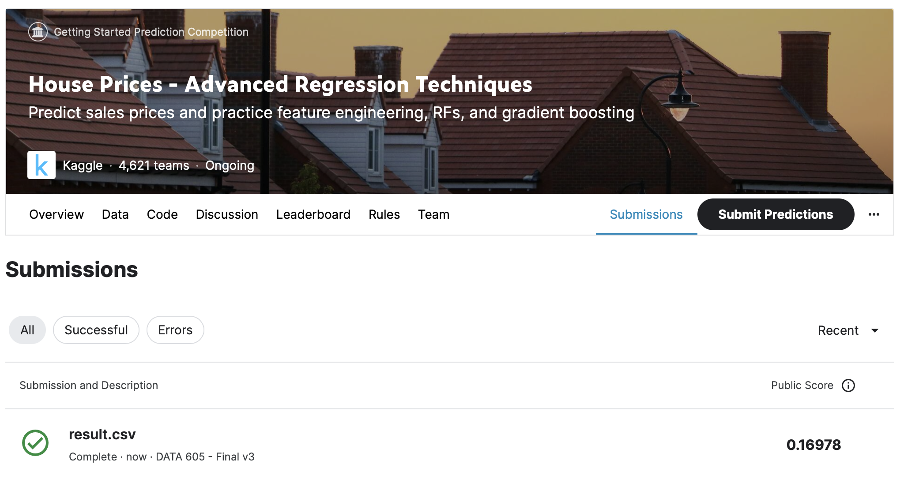
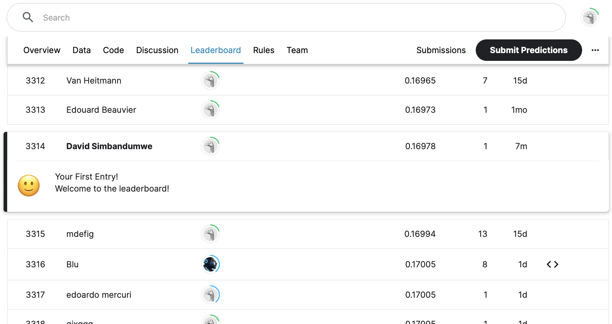

```{r setup, include=FALSE}

knitr::opts_chunk$set(echo = TRUE, warning = FALSE, message = FALSE)
rm(list=ls())

```


```{r, include=FALSE}

library(matlib) 
library(pracma)
library(ggplot2)

library(Matrix)
library(igraph)
library(openintro)
library(expm) 
library(matrixcalc)

library(igraph)

library(tidyverse)
library(keras)
library(yardstick)
library(tidymodels)
library(workflows)

library(nnet)
library(caret)

library(corrplot)
library(GGally)
library(stats)
library(MASS)

library(textrecipes)
library(recipes)
library(modeldata)


```


# Problem 1 - Playing with PageRank (30 Points)
You’ll verify for yourself that PageRank works by performing calculations on a small universe of web pages.
Let’s use the 6 page universe that we had in the previous discussion For this directed graph, perform the following calculations in R.


- Form the A matrix. Then, introduce decay and form the B matrix as we did in the course notes. (5 Points)

```{r}

# create transition matrix
A = matrix(c(0,0,1/3,0,0,0, 1/2,0,1/3,0,0,0, 1/2,0,0,0,0,0, 0,0,0,0,1/2,1, 0,0,1/3,1/2,0,0, 0,0,0,1/2,1/2,0),6)
print('A Transition Matrix')
print(round(A,3))

# replace 2nd row with random prob for the 6 pages 1/6
ri <- matrix(c(1/6, 1/6, 1/6, 1/6, 1/6, 1/6),ncol=6)
A[2,] <- ri
A <- t(A)
print(round(A,3))

# calculate the decay
decay <- 0.85

n <- nrow(A)

B <- decay*A + (1-decay)/n
print('---')
print('\ B Matrix with Decay')
print(round(B,4))


```


- Start with a uniform rank vector r and perform power iterations on B till convergence. That is, compute the solution r = Bn × r. Attempt this for a sufficiently large n so that r actually converges. (5 Points)

```{r}

ri = matrix(c(1/6,1/6,1/6,1/6,1/6,1/6),6)
ri

n <- 10
r10 <- matrix.power(B, n) %*%  ri
r10

n <- 20
r20 <- matrix.power(B, n) %*%  ri
r20


n <- 30
r30 <- matrix.power(B, n) %*%  ri
r30

# by n = 30 the result vector converges
print('---')
print('1.b) Matrix Converges by n=30 ')
rf <- r30
rf

```


- Compute the eigen-decomposition of B and verify that you indeed get an eigenvalue of 1 as the largest eigenvalue and that its corresponding eigenvector is the same vector that you obtained in the previous power iteration method. Further, this eigenvector has all positive entries and it sums to 1.(10 points)


```{r}

ev <- eigen(B)
ev

# max eigenvalue
print('---')
print('eigen values')
ev$values
print('max eigen value is 1')
which.max(ev$values)

# same vector and sums to 1
e_vec <- as.numeric((1/sum(ev$vectors[,1]))*ev$vectors[,1])
print('same vector')
e_vec
print('vector sums to 1')
sum(e_vec)


```


Use the graph package in R and its page.rank method to compute the Page Rank of the graph as given in A. Note that you don’t need to apply decay. The package starts with a connected graph and applies decay internally. Verify that you do get the same PageRank vector as the two approaches above. (10 points)


```{r}

A_2 <- matrix(c(0,1/2,1/2,0,0,0,0,0,0,0,0,0,1/3,1/3,0,0,1/3,0,0,0,0,0,1/2,1/2,0,0,0,1/2,0,1/2,0,0,0,1,0,0),nrow=6,ncol=6,byrow = T)

igraph_A <- graph_from_adjacency_matrix(A_2, weighted=TRUE,mode = "directed")
plot(igraph_A)

```


```{r}
ipageRank <- as.matrix(page.rank(igraph_A)$vector)
round(ipageRank,4) == round(rf,4)
```


# Problem 2 - digit-recognizer

MNIST ("Modified National Institute of Standards and Technology") is the de facto “hello world” dataset of computer vision. Since its release in 1999, this classic dataset of handwritten images has served as the basis for benchmarking classification algorithms. As new machine learning techniques emerge, MNIST remains a reliable resource for researchers and learners alike.


Using the training.csv file, plot representations of the first 10 images to understand the data format. Go ahead and divide all pixels by 255 to produce values between 0 and 1. (This is equivalent to min-max scaling.) (5 points)

```{r}

train_df <- read_csv("./Final/digit-recognizer/train.csv", show_col_types = FALSE)

# print first 10
head(train_df, n = 10) %>%
  mutate(id = row_number()) %>%
  pivot_longer(cols = -c(label, id)) %>%
  mutate(
    pixel = as.numeric(str_extract(name, "\\d+")),
    x = pixel %% 28,
    y = 28 - pixel %/% 28
  ) %>%
  ggplot(aes(x, y, fill = value)) +
  geom_tile() +
  facet_wrap(~ label + id)

```


```{r}

labels = train_df[,1]
train_data <- train_df[,-1]/255


# print first 10
head(cbind(labels,train_data), n = 10) %>%
  mutate(id = row_number()) %>%
  pivot_longer(cols = -c(label, id)) %>%
  mutate(
    pixel = as.numeric(str_extract(name, "\\d+")),
    x = pixel %% 28,
    y = 28 - pixel %/% 28
  ) %>%
  ggplot(aes(x, y, fill = value)) +
  geom_tile() +
  facet_wrap(~ label + id)


```


What is the frequency distribution of the numbers in the dataset? (5 points)

|		The individual images are mainly white space with a uniform background color of white creating a sparse dataset


```{r}

train_vec=as.vector(unlist(train_data)) 
hist(train_vec, breaks = 100)


train_arr=array(train_vec, dim=c(nrow(train_data),28,28))
train_arr<-train_arr/255


logInd<-train_arr>0
hist(train_arr[logInd], breaks = 100, freq = FALSE)


```


For each number, provide the mean pixel intensity. What does this tell you? (5 points)

|		The mean pixel intensity for each number is relatively low 0.09 and 0.10 indicating that most images are primarily white space

```{r}

train_freq <- as.data.frame(table(labels)/nrow(train_data))
train_freq

ggplot(train_freq, aes(x = label, y = Freq, fill = Freq)) +
	geom_bar(stat = 'identity') +
	scale_fill_gradient(low = "lightgray", high = "red")


```


Reduce the data by using principal components that account for 95% of the variance. How many components did you generate? Use PCA to generate all possible components (100% of the variance). How many components are possible? Why? (5 points)


```{r}

# create vector and array
train_vec=as.vector(unlist(train_data)) 
train_arr=array(train_vec, dim=c(nrow(train_data),28,28))

# convert this to 784 rows (pixels) and 42000 columns (images)
train_flat_mat<-t(matrix(train_arr, ncol=28*28, byrow = FALSE))


train_pca<-prcomp(train_flat_mat, scale = TRUE)
train_cumvar <- (cumsum(train_pca$sdev^2) / sum(train_pca$sdev^2))


# 95% variance
cumvar_95 <- which.max(train_cumvar >= .95)
print(paste0("At 95% variance there were ", (cumvar_95), " components generated."))


```


```{r}

var_explained = train_pca$sdev^2 / sum(train_pca$sdev^2)

qplot(c(1:50), var_explained[1:50]) + 
  geom_line() + 
  xlab("Principal Component") + 
  ylab("Variance Explained") +
  ggtitle("Scree Plot First 50 Only") 

```


Use PCA to generate all possible components (100% of the variance). How many components are possible? Why? (5 points)
|		There are 704 components generated. There are more components because of the increasing the accounted accuracy. 


```{r}

# 95% variance
cumvar_100 <- which.max(train_cumvar >= 1)
print(paste0("At 100% variance there were ", (cumvar_100), " components generated."))


```


Plot the first 10 images generated by PCA. They will appear to be noise. Why? (5 points)
|		Images generated by PCA typically have noise.

```{r}

par(mfrow = c (2, 5))

for (i in 1:10){
 image(1:28, 1:28, array(train_pca$x[,i], dim = c(28, 28)))
}


```


Now, select only those images that have labels that are 8’s. Re-run PCA that accounts for all of the variance (100%). Plot the first 10 images. What do you see? (5 points)


```{r}

# create array and matrix
eights<-which(labels == 8)
eights_arr<-train_arr[eights,,]
eights_flat_mat<-t(matrix(eights_arr, ncol=28*28, byrow = FALSE))

# pca
eights_pca <- prcomp(eights_flat_mat, scale = TRUE)
eights_cumvar <- (cumsum(eights_pca$sdev^2) / sum(eights_pca$sdev^2))

# 100% variance
eights_100 <- which.max(eights_cumvar >= 1)
print(paste0("At 100% variance there were ", (eights_100), " components generated."))


```


```{r}

var_explained = train_pca$sdev^2 / sum(train_pca$sdev^2)

qplot(c(1:50), var_explained[1:50]) + 
  geom_line() + 
  xlab("Principal Component") + 
  ylab("Variance Explained") +
  ggtitle("Scree Plot First 50 Only") 

```


```{r}

par(mfrow = c (2, 5))

for (i in 1:10){
 image(1:28, 1:28, array(eights_pca$x[,i], dim = c(28, 28)))
}


```


An incorrect approach to predicting the images would be to build a linear regression model with y as the digit values and X as the pixel matrix. Instead, we can build a multinomial model that classifies the digits. Build a multinomial model on the entirety of the training set. Then provide its classification accuracy (percent correctly identified) as well as a matrix of observed versus forecast values (confusion matrix). This matrix will be a 10 x 10, and correct classifications will be on the diagonal. (10 points)


```{r}

# create model
train_labels_new <- as.factor(train_df$label)
train_flat_new<-as.data.frame(cbind(labels, t(train_flat_mat)  ))

# multinomial model
nnet_m <- nnet::multinom(label ~., data = train_flat_new, MaxNWts = 10000000)

# predict images
prediction_model <- predict(nnet_m, train_flat_new)
confusionMatrix(prediction_model, train_labels_new)


```


# Problem 3: Advanced Regression Techniques

Descriptive and Inferential Statistics. Provide univariate descriptive statistics and appropriate plots for the training data set. Provide a scatterplot matrix for at least two of the independent variables and the dependent variable. Derive a correlation matrix for any three quantitative variables in the dataset. Test the hypotheses that the correlations between each pairwise set of variables is 0 and provide an 80% confidence interval. Discuss the meaning of your analysis. Would you be worried about familywise error? Why or why not? 5 points

```{r}

# read in training data
house_train_df <- read_csv("./Final/house-prices/train.csv")
house_train_df %>% select_if(is.numeric) %>% summary()


# reokace b/a with 0 where applicable
house_train_df <- house_train_df %>% mutate(
                    LotFrontage = ifelse(is.na(LotFrontage), 0, LotFrontage),
                    MasVnrArea = ifelse(is.na(MasVnrArea), 0, MasVnrArea),
                    GarageYrBlt = ifelse(is.na(MasVnrArea), mean(GarageYrBlt, na.rm = TRUE), MasVnrArea),
                    FireplaceQu = ifelse(is.na(FireplaceQu), "None", FireplaceQu),
                    PoolQC = ifelse(is.na(PoolQC), "None", PoolQC)
                  )

#Print number of null
print('---- nulls ----')
all_nas <- colSums(sapply(house_train_df[names(house_train_df)], is.na))
all_nas[which(all_nas > 0)]


```


Provide univariate descriptive statistics and appropriate plots for the training data set.

```{r}

# SalePrice
ggplot(house_train_df, aes(x = SalePrice)) + 
  geom_histogram() +
  scale_x_continuous(labels = comma)

# GrLivArea
ggplot(house_train_df, aes(x = GrLivArea)) + 
  geom_histogram()

# Neighborhood
ggplot(house_train_df, aes(x = Neighborhood)) + 
  geom_bar() +
  coord_flip()
	
# BedroomAbvGr
ggplot(house_train_df, aes(x = BedroomAbvGr)) + 
  geom_bar()


# LotArea
ggplot(house_train_df, aes(x = LotArea)) + 
  geom_histogram()

```


Provide a scatter plot matrix for at least two of the independent variables and the dependent variable.

```{r}

house_train_df %>% 
	dplyr::select('LotFrontage','LotArea','OverallQual','OverallCond','YearBuilt','YearRemodAdd'
		,'FullBath','BedroomAbvGr','TotRmsAbvGrd','GrLivArea','YrSold','SalePrice') %>%
	ggpairs()

ggplot(house_train_df, aes(y=SalePrice, x=GrLivArea)) + geom_point()
ggplot(house_train_df, aes(y=SalePrice, x=LotFrontage)) + geom_point()
ggplot(house_train_df, aes(y=SalePrice, x=YearRemodAdd)) + geom_point()

```


Derive a correlation matrix for any three quantitative variables in the dataset.

```{r}

n_df <- house_train_df %>% 
	dplyr::select('LotArea','GrLivArea','FullBath') %>% 
	drop_na()

mycol=colorRampPalette(c("red","orange","yellow","white","green", "dark green"))(20)
mycor=cor(n_df)
mycor
corrplot(mycor, method="ellipse", type="upper",
         addCoef.col=TRUE, tl.cex=.7, number.cex=.5, insig="blank",
         order="hclust", hclust.method="centroid", number.digits=2,
         col=mycol)


```


Test the hypotheses that the correlations between each pairwise set of variables is 0 and provide an 80% confidence interval. Discuss the meaning of your analysis. Would you be worried about familywise error? Why or why not? 5 points

|		- LotArea and GrLivArea - p-value below 0.2 reject the null hypothesis that a correlation does not exist. correlation is = 0.263
|		- LotArea and FullBath - p-value below 0.2 reject the null hypothesis that a correlation does not exist. correlation is = 0.126
|		- GrLivArea and FullBath - p-value below 0.2 reject the null hypothesis that a correlation does not exist. correlation is = 0.630

Would you be worried about familywise error? Why or why not? 5 points

|		- The familywise error reflects the increased probability of making a Type 1 error if we are running multiple Hypothesis tests. Even though the correlation tests below we can isolate the Hypothesis test so that we are only testing 2 variables at a time we will be unable to control for the variations in the other variable so we should worry about the familywise error rate. 


```{r}

cor.test(house_train_df$LotArea, house_train_df$GrLivArea, conf.level = 0.8)
cor.test(house_train_df$LotArea, house_train_df$FullBath, conf.level = 0.8)
cor.test(house_train_df$GrLivArea, house_train_df$FullBath, conf.level = 0.8)


```


Linear Algebra and Correlation. Invert your correlation matrix from above. (This is known as the precision matrix and contains variance inflation factors on the diagonal.) Multiply the correlation matrix by the precision matrix, and then multiply the precision matrix by the correlation matrix. Conduct LU decomposition on the matrix. 5 points


```{r}

mycor.inv = solve(mycor)
mycor.inv


m_mi <- mycor %*% mycor.inv

mycor.inv  %*% mycor

lu.decomposition(m_mi)

```


Calculus-Based Probability & Statistics. Many times, it makes sense to fit a closed form distribution to data. Select a variable in the Kaggle.com training dataset that is skewed to the right, shift it so that the minimum value is absolutely above zero if necessary. Then load the MASS package and run fitdistr to fit an exponential probability density function. (See https://stat.ethz.ch/R-manual/R- devel/library/MASS/html/fitdistr.html ). Find the optimal value of λ for this distribution, and then take 1000 samples from this exponential distribution using this value (e.g., rexp(1000, λ)). Plot a histogram and compare it with a histogram of your original variable. Using the exponential pdf, find the 5th and 95th percentiles using the cumulative distribution function (CDF). Also generate a 95% confidence interval from the empirical data, assuming normality. Finally, provide the empirical 5th percentile and 95th percentile of the data. Discuss. 10 points


```{r}

ggplot(house_train_df, aes(x=GrLivArea)) + geom_histogram()
m <- min(house_train_df$GrLivArea)
m

GrLivArea_shift <- house_train_df$GrLivArea - m
ggplot() + geom_histogram(aes(x=GrLivArea_shift))
exp_GrLivArea <- fitdistr(GrLivArea_shift,'exponential')

lamb_GrLivArea <- exp_GrLivArea$estimate
lamb_GrLivArea

```


```{r}

exp_sample <- rexp(1000, lamb_GrLivArea)
summary(exp_sample)

ggplot() + geom_histogram(aes(x=exp_sample))

```


```{r}

l <- qexp(0.05, lamb_GrLivArea)
l

u <- qexp(0.95, lamb_GrLivArea)
u

quantile(exp_sample, probs = c(0.05,0.95))
```


Modeling. Build some type of multiple regression model and submit your model to the competition board. Provide your complete model summary and results with analysis. Report your Kaggle.com user name and score. 10 points


## Load data
|		First step is to load the model and tidy the data. The NAs in the dataset actually represent the absences of a particular feature vs invalid data. As part of the tidy process we will transform NAs into a value that can be processed. 


```{r}

# read in training data
house_train_df <- read_csv("./Final/house-prices/train.csv")
house_train_df %>% select_if(is.numeric) %>% summary()

# reokace b/a with 0 where applicable
house_train_df <- house_train_df %>% mutate(
                    LotFrontage = ifelse(is.na(LotFrontage), 0, LotFrontage),
                    MasVnrArea = ifelse(is.na(MasVnrArea), 0, MasVnrArea),
                    GarageYrBlt = ifelse(is.na(MasVnrArea), mean(GarageYrBlt, na.rm = TRUE), MasVnrArea),
                    FireplaceQu = ifelse(is.na(FireplaceQu), "None", FireplaceQu),
                    BsmtFinSF1 = ifelse(is.na(BsmtFinSF1), 0, BsmtFinSF1),
                    TotalBsmtSF = ifelse(is.na(TotalBsmtSF), 0, TotalBsmtSF),
                    PoolQC = ifelse(is.na(PoolQC), "None", PoolQC),
                    Street = ifelse(is.na(Street), "None", Street),
                    Alley = ifelse(is.na(Alley), "None", Alley),
                    GarageType = ifelse(is.na(GarageType), "None", GarageType),
                    GarageFinish = ifelse(is.na(GarageFinish), "None", GarageFinish),
                    GarageQual = ifelse(is.na(GarageQual), "None", GarageQual),
                    GarageCond = ifelse(is.na(GarageCond), "None", GarageCond),
                    BsmtQual = ifelse(is.na(BsmtQual), "None", BsmtQual),
                    KitchenQual = ifelse(is.na(KitchenQual), "None", KitchenQual),
                    GrLivArea = ifelse(is.na(GrLivArea), 0, GrLivArea)
                  )

#Print number of null
print('---- nulls ----')
all_nas <- colSums(sapply(house_train_df[names(house_train_df)], is.na))
all_nas[which(all_nas > 0)]


```


## Baseline - Full Numeric Model
|		As a baseline we I developed a numeric model that will include all numeric fields. Using stepwise optimization of the model we get the following baseline model.

```{r}

# moduel with numeric variables only
houseNum_df <- house_train_df %>%  dplyr::select_if(is.numeric)
ml.num <- lm(SalePrice ~., houseNum_df)


# stepwize optimizaiton
ml.num.step <- stats::step(ml.num, criteria='AIC', trace=FALSE,direction='both')
summary(ml.num.step)


# residuals
par(mfrow=c(2,2))
plot(ml.num.step)


```

lm(formula = SalePrice ~ MSSubClass + LotArea + OverallQual + 
    OverallCond + YearBuilt + YearRemodAdd + MasVnrArea + BsmtFinSF1 + 
    BsmtUnfSF + `1stFlrSF` + `2ndFlrSF` + LowQualFinSF + BsmtFullBath + 
    FullBath + BedroomAbvGr + KitchenAbvGr + TotRmsAbvGrd + Fireplaces + 
    GarageCars + WoodDeckSF + ScreenPorch, data = houseNum_df)
    

## Analysis - Candidate Variable
|		Starting with the output from the stepwize optimized model we analyze the correlation between the independent variables and the Sale Price to identify a few candidate variable to focus on. 


```{r}

candidates <- c('SalePrice','MSSubClass','LotArea','LotFrontage','OverallQual','YearBuilt','YearRemodAdd',
				'BsmtFinSF1','BsmtUnfSF','TotalBsmtSF','1stFlrSF','2ndFlrSF','GrLivArea','BsmtFullBath',
				'FullBath','BedroomAbvGr','KitchenAbvGr','TotRmsAbvGrd','Fireplaces','GarageCars','GarageArea',
				'WoodDeckSF','OpenPorchSF','FireplaceQu','SaleCondition','OverallCond','CentralAir','PoolQC',
				'ExterCond','MasVnrArea','TotalBsmtSF','ScreenPorch')

full_df <- house_train_df %>%
   dplyr::select(all_of(candidates)) %>%
   mutate(ExterCond=as.numeric(as.factor(ExterCond)),
			FullBath=as.numeric(as.factor(FullBath)),
			FireplaceQu=as.numeric(as.factor(FireplaceQu)), 
			SaleCondition=as.numeric(as.factor(SaleCondition)), 
			GarageCars=as.numeric(as.factor(GarageCars)),
			OverallCond=as.numeric(as.factor(OverallCond)), 
			CentralAir=as.numeric(as.factor(CentralAir)),
			PoolQC=as.numeric(as.factor(PoolQC))
   )

ames_corr <- full_df
ames_correlations <- cor(ames_corr, method = c("pearson"))
corrplot(ames_correlations, method="color")

```


|		Filtering the canidate variables with a correlation of 0.3 or higher generates that smaller list. Please note that across the range of variable there the negative correlation amounts are minimal so we will focus on positive correlation. 


```{r}

t <- ames_correlations
t[t < 0.3 ] <- 0
corrplot(t, method="color")


t <- as.data.frame(ames_correlations)
t <- t[t$SalePrice > 0.3]
t <- t %>% dplyr::filter(SalePrice > 0.3)


candidates <- names(t)
candidates

ames_corr %>% 
	dplyr::select(all_of(candidates)) %>% 
	ggpairs()

corrplot(as.matrix(t), method="color")


```


|		Analyzing the relationship between candidate variables and Sale Price graphically

```{r}


ggplot(house_train_df, aes(y=SalePrice, x=OverallQual)) + 
	scale_y_continuous(labels = comma) + geom_point()

ggplot(house_train_df, aes(y=SalePrice, x=YearBuilt)) + 
	scale_y_continuous(labels = comma) + geom_point()

ggplot(house_train_df, aes(y=SalePrice, x=YearRemodAdd)) + 
	scale_y_continuous(labels = comma) + geom_point()

ggplot(house_train_df, aes(y=SalePrice, x=BsmtFinSF1)) + 
	scale_y_continuous(labels = comma) + geom_point()

ggplot(house_train_df, aes(y=SalePrice, x=TotalBsmtSF)) + 
	scale_y_continuous(labels = comma) + geom_point()

ggplot(house_train_df, aes(y=SalePrice, x=house_train_df$'1stFlrSF')) + 
	scale_y_continuous(labels = comma) + geom_point()

ggplot(house_train_df, aes(y=SalePrice, x=house_train_df$'2ndFlrSF')) + 
	scale_y_continuous(labels = comma) + geom_point()

ggplot(house_train_df, aes(y=SalePrice, x=GrLivArea)) + 
	scale_y_continuous(labels = comma) + geom_point()

ggplot(house_train_df, aes(y=SalePrice, x=FullBath)) + 
	scale_y_continuous(labels = comma) + geom_point()

ggplot(house_train_df, aes(y=SalePrice, x=TotRmsAbvGrd)) + 
	scale_y_continuous(labels = comma) + geom_point()

ggplot(house_train_df, aes(y=SalePrice, x=Fireplaces)) + 
	scale_y_continuous(labels = comma) + geom_point()

ggplot(house_train_df, aes(y=SalePrice, x=GarageCars)) + 
	scale_y_continuous(labels = comma) + geom_point()

ggplot(house_train_df, aes(y=SalePrice, x=GarageArea)) + 
	scale_y_continuous(labels = comma) + geom_point()

ggplot(house_train_df, aes(y=SalePrice, x=WoodDeckSF)) + 
	scale_y_continuous(labels = comma) + geom_point()

ggplot(house_train_df, aes(y=SalePrice, x=OpenPorchSF)) + 
	scale_y_continuous(labels = comma) + geom_point()

ggplot(house_train_df, aes(y=SalePrice, x=MasVnrArea)) + 
	scale_y_continuous(labels = comma) + geom_point()


```


|		Exploring the histograms for some key candiate variables

```{r}


ggplot(house_train_df, aes(x=log(SalePrice))) + geom_histogram()
ggplot(house_train_df, aes(x=YearBuilt-min(house_train_df$YearBuilt))) + geom_histogram()
ggplot(house_train_df, aes(x=YearRemodAdd-min(house_train_df$YearRemodAdd))) + geom_histogram()
ggplot(house_train_df, aes(x=log(TotalBsmtSF))) + geom_histogram()
ggplot(house_train_df, aes(x=house_train_df$'1stFlrSF')) + geom_histogram()
ggplot(house_train_df, aes(x=GrLivArea)) + geom_histogram()
ggplot(house_train_df, aes(x=GarageArea)) + geom_histogram()


```


|		Exploring the possibility of transforming variables for a better fit. 

```{r}


ggplot(house_train_df, aes(y=SalePrice, x=YearBuilt)) + 
	scale_y_continuous(labels = comma) + geom_point() +
	facet_wrap(vars(Neighborhood))

ggplot(house_train_df, aes(y=SalePrice, x=YearBuilt)) + 
	scale_x_log10() + geom_point()
	
ggplot(house_train_df, aes(y=SalePrice, x=TotalBsmtSF)) + 
	scale_x_log10() + geom_point()

ggplot(house_train_df, aes(y=SalePrice, x=TotalBsmtSF)) + 
	scale_x_sqrt() + geom_point()


```


[1] "SalePrice"    "OverallQual"  "YearBuilt"    "YearRemodAdd" "BsmtFinSF1"   "TotalBsmtSF"  "1stFlrSF"     "2ndFlrSF"    
 [9] "GrLivArea"    "FullBath"     "TotRmsAbvGrd" "Fireplaces"   "GarageCars"   "GarageArea"   "WoodDeckSF"   "OpenPorchSF" 
[17] "MasVnrArea"  


## Full Model

|		Adding key factor variables to candidate numeric variable identified previously. 


```{r}


candidates <- c('SalePrice','OverallQual','YearBuilt','YearRemodAdd','BsmtFinSF1','BsmtUnfSF',
				'TotalBsmtSF',
				'1stFlrSF','2ndFlrSF','GrLivArea','BsmtFullBath','FullBath','HalfBath','KitchenAbvGr',
				'TotRmsAbvGrd','Fireplaces','GarageCars','GarageArea','WoodDeckSF','OpenPorchSF',
				'FireplaceQu',
				'SaleCondition','OverallCond','CentralAir','PoolQC','ExterCond','YearRemodAdd',
				'MasVnrArea',
				'MSSubClass','MSZoning','Street','Alley','LotShape','LandContour','LotConfig','HouseStyle',
				'RoofStyle','RoofMatl','BsmtQual','BsmtCond','BsmtFinType1','KitchenQual','GarageType',
				'GarageQual')


full_df <- house_train_df %>%
   dplyr::select(all_of(candidates)) %>%
   mutate(ExterCond=(as.factor(ExterCond)),
			MSSubClass=(as.factor(MSSubClass)),
			MSZoning=(as.factor(MSZoning)),
			Street=(as.factor(Street)),
			Alley=(as.factor(Alley)),
			LotShape=(as.factor(LotShape)),
			LandContour=(as.factor(LandContour)),
			LotConfig=(as.factor(LotConfig)),
			HouseStyle=(as.factor(HouseStyle)),
			RoofStyle=(as.factor(RoofStyle)),
			RoofMatl=(as.factor(RoofMatl)),
			BsmtQual=(as.factor(BsmtQual)),
			BsmtCond=(as.factor(BsmtCond)),
			BsmtFinType1=(as.factor(BsmtFinType1)),
			KitchenQual=(as.factor(KitchenQual)),
			FireplaceQu=(as.factor(FireplaceQu)), 
			GarageType=(as.factor(GarageType)), 
			GarageQual=(as.factor(GarageQual)), 
			SaleCondition=(as.factor(SaleCondition)), 
			OverallCond=c(as.factor(OverallCond)), 
			CentralAir=(as.factor(CentralAir)),
			PoolQC=(as.factor(PoolQC))
   )


#full_df <- ames_corr 
ml.full <- lm(formula = SalePrice ~ ., data = full_df)


# stepwize optimizaiton
ml.full.step <- stats::step(ml.full, criteria='AIC', trace=FALSE,direction='both')
summary(ml.full.step)


# residuals
par(mfrow=c(2,2))
plot(ml.full.step)

```


## Model 1

Removed the following variable to generate the final model
- GarageCars
- WoodDeckSF
- GarageArea
- OverallCond
- MSSubClass
- MSZoning
- BsmtFinType1
- LotConfig


```{r}


candidates <- c('SalePrice','OverallQual','YearBuilt','BsmtUnfSF','TotalBsmtSF',
				'1stFlrSF','2ndFlrSF','KitchenAbvGr', 'TotRmsAbvGrd','Fireplaces',
				'SaleCondition',
				'PoolQC', 'MasVnrArea','LotShape', 'LandContour',
				'RoofMatl', 'BsmtQual','KitchenQual')

df1 <- full_df %>% dplyr::select(all_of(candidates))


# model v1
ml.v1 <- lm(formula = SalePrice ~ ., data = df1)


# stepwize optimization
ml.v1.step <- stats::step(ml.v1, criteria='AIC', trace=FALSE,direction='both')
summary(ml.v1.step)


# residuals
par(mfrow=c(2,2))
plot(ml.v1.step)


```

The residual analysis indicates that there is still a little bit of work that we could do to improve the model. 


## Predict
Selected model 2 for the predictions


```{r}

house_test_df <- read_csv("./Final/house-prices/test.csv")


# reokace b/a with 0 where applicable
house_test_df <- house_test_df %>% mutate(
                    LotFrontage = ifelse(is.na(LotFrontage), 0, LotFrontage),
                    MasVnrArea = ifelse(is.na(MasVnrArea), 0, MasVnrArea),
                    GarageYrBlt = ifelse(is.na(MasVnrArea), mean(GarageYrBlt, na.rm = TRUE), MasVnrArea),
                    FireplaceQu = ifelse(is.na(FireplaceQu), "None", FireplaceQu),
                    BsmtFinSF1 = ifelse(is.na(BsmtFinSF1), 0, BsmtFinSF1),
                    TotalBsmtSF = ifelse(is.na(TotalBsmtSF), 0, TotalBsmtSF),
                    PoolQC = ifelse(is.na(PoolQC), "None", PoolQC),
                    Street = ifelse(is.na(Street), "None", Street),
                    Alley = ifelse(is.na(Alley), "None", Alley),
                    GarageType = ifelse(is.na(GarageType), "None", GarageType),
                    GarageFinish = ifelse(is.na(GarageFinish), "None", GarageFinish),
                    GarageQual = ifelse(is.na(GarageQual), "None", GarageQual),
                    GarageCond = ifelse(is.na(GarageCond), "None", GarageCond),
                    BsmtQual = ifelse(is.na(BsmtQual), "None", BsmtQual),
                    KitchenQual = ifelse(is.na(KitchenQual), "Gd", KitchenQual),
                    GrLivArea = ifelse(is.na(GrLivArea), 0, GrLivArea),
                    BsmtUnfSF = ifelse(is.na(BsmtUnfSF), 0, BsmtUnfSF)
                  )


# identify variables with null values
all_nas <- colSums(sapply(house_test_df[names(house_test_df)], is.na))
all_nas[which(all_nas > 0)]


house_test_df <- house_test_df %>%
   mutate(ExterCond=(as.factor(ExterCond)),
			MSSubClass=(as.factor(MSSubClass)),
			MSZoning=(as.factor(MSZoning)),
			Street=(as.factor(Street)),
			Alley=(as.factor(Alley)),
			LotShape=(as.factor(LotShape)),
			LandContour=(as.factor(LandContour)),
			LotConfig=(as.factor(LotConfig)),
			HouseStyle=(as.factor(HouseStyle)),
			RoofStyle=(as.factor(RoofStyle)),
			RoofMatl=(as.factor(RoofMatl)),
			BsmtQual=(as.factor(BsmtQual)),
			BsmtCond=(as.factor(BsmtCond)),
			BsmtFinType1=(as.factor(BsmtFinType1)),
			KitchenQual=(as.factor(KitchenQual)),
			FireplaceQu=(as.factor(FireplaceQu)), 
			GarageType=(as.factor(GarageType)), 
			GarageQual=(as.factor(GarageQual)), 
			SaleCondition=(as.factor(SaleCondition)), 
			OverallCond=c(as.factor(OverallCond)), 
			CentralAir=(as.factor(CentralAir)),
			PoolQC=(as.factor(PoolQC))
   )


# predict new values
house_test_df$SalePrice <- predict.lm(ml.v1.step, house_test_df, type = "response")


# plot housing prices vs neighborhood
ggplot(house_test_df, aes(x=SalePrice, fill=Neighborhood)) + geom_histogram()

```


```{r}

# create results dataframe
result_df <- house_test_df %>% dplyr::select(Id,SalePrice)

# identify na predictions
all_nas <- colSums(sapply(result_df[names(result_df)], is.na))
all_nas[which(all_nas > 0)]

# write results
write.csv(result_df,"./Final/house-prices/result.csv", row.names = FALSE)


```


## Submit to Kaggle competion

The model score once submited to the Kaggle competion was 0.16978.






